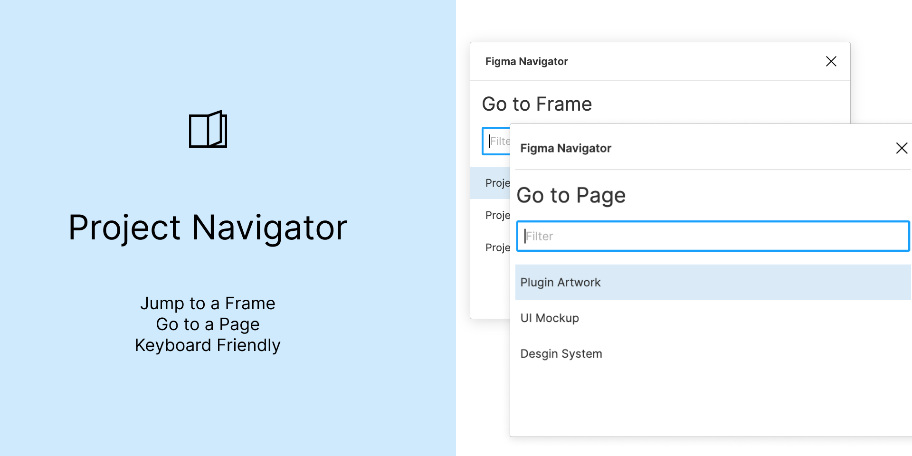
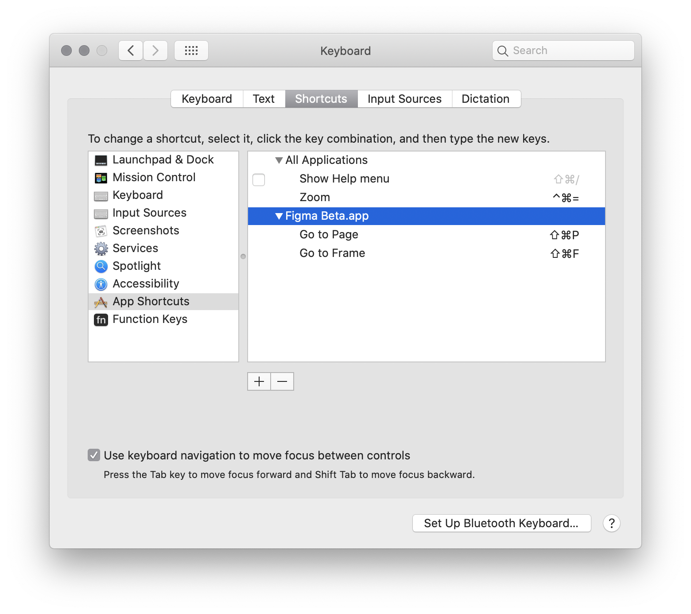

Figma plugin that enhances navigation across pages and frames.

There are two commands in this plugin:
* Go to Page – shows a popup to navigate to a page in the current File
* Go to Frame – shows a popup to navigate to a frame in the current Page

Use the command shortcut (Cmd+/) to quickly find plugin command – type "Go". 
Select the item with the mouse or use keyboard arrows and Enter key to navigate to the item. 
Type in part of the name to narrow down the list.

## MacOS Shortcuts

For faster access to plugin commands on macOS go to System Preferences / Keyboard / Shortcuts.
Select `App Shortcuts` in the right pane and hit `+` sign below the list. 
Select Figma (or Figma Beta) application, type in `Go to Page` or `Go to Frame` exactly as written here.
Choose shortcut you wish to use, but first test it in Figma to verify it doesn't conflict with something.

